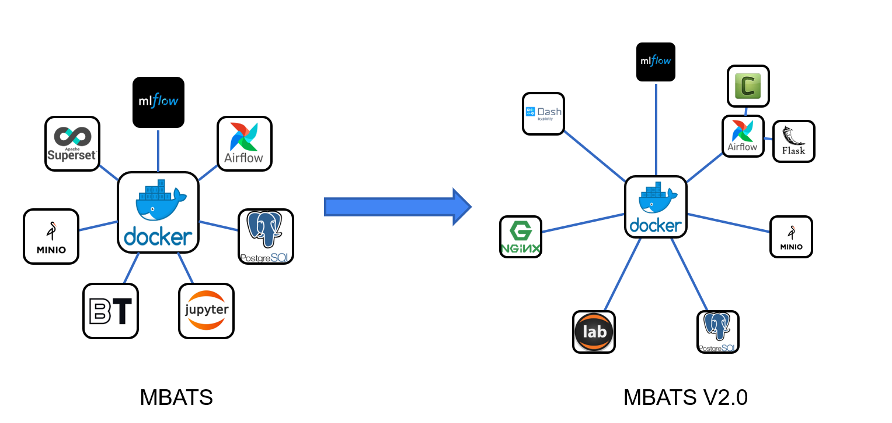
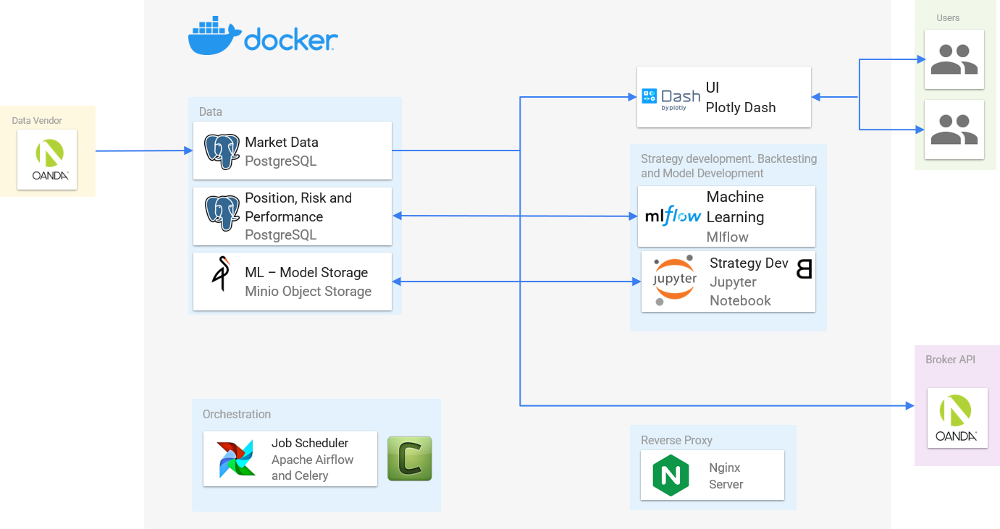

<p align="center">
    <a target="_blank"></a>
    <br />
    <br />
    <b>Microservices Based Algorithmic Trading System - INFRASTRUCTURE UPDATE</b>
    <br />
    <br />
</p>

[](https://opensource.org/licenses/BSD-3-Clause)

---

[MBATS](https://github.com/saeed349/Microservices-Based-Algorithmic-Trading-System) is a docker based platform for developing, testing and deploying Algorthmic Trading strategies with a focus on Machine Learning based algorithms.

This repository is an advanced version of the MBATS infrastructure without any of the business logic. Compared to MBATs, here are the changes that are made in this version.
* Celery workers for Airflow.
* Replaced Superset with a multi-page Dash Web-application.
* Replaced Jupyer notebook with Jupyter lab
* Added a Flask rest-ful container for processing ETL jobs. 
* Wrapped all the services in a Nginx reverse proxy server for single point of access.

Now all these changes are made to ensure cross platform compatibility between the local docker-machine and the cloud (Google cloud here). To know more about the reasons for these new services and changes, plese refer to the below articles. 

[Latest Linkedin Article on scaling MBATS to the cloud using Terraform](https://www.linkedin.com/post/edit/6619730514188267520/) <br>
[Linkedin Article about MBATS](https://www.linkedin.com/post/edit/6619730514188267520/)



## Architecture

   
## Quickstart

Please use this repository for the infrastructure and for all the Quant Trading business logic use the orignal [MBATS](https://github.com/saeed349/Microservices-Based-Algorithmic-Trading-System) repo. 

1. Downlod/Clone the Github Repository 
2. Run docker compose, to start with 5 celery workers:  
 ```docker-compose -f "docker-compose.yml" up --build -d scale worker=5```  
First run would take some time as all the Docker base images need to be downloaded.  
Once its is running, you can access the following components from the webaddress
    * Dash Web-app:http://localhost:8050
    * Jupyter Lab:http://localhost:8888
    * Airflow: http://localhost:8080
    * MLflow: http://localhost:5500
    * PgAdmin: http://localhost:1234
    * Minio: http://localhost:9000
    * Flask Restful ETL Server: http://localhost:8060
    * Nginx Reverse Proxy Server: http://localhost:80


## Built With
This project has been devloped and tested on 2 Docker environments
* [WSL](https://docs.microsoft.com/en-us/windows/wsl/about)
* [Docker Toolbox](https://docs.docker.com/toolbox/toolbox_install_windows/). 
* IDE - Visual Studio Code: Main reason being the [Container Debugger Feature](https://code.visualstudio.com/docs/remote/containers#_debugging-in-a-container) 


## Contributing

All code contributions must go through a pull request and approved by a core developer before being merged. This is to ensure proper review of all the code.

## License

This repository is available under the [BSD 3-Clause License](./LICENSE).

## Authors

* **Saeed Rahman** - [LinkedIn](https://www.linkedin.com/in/saeed-349/)
